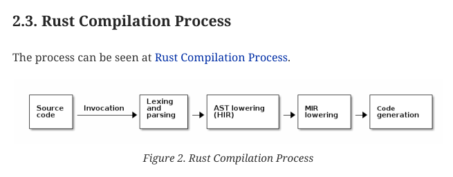

# Book Template - AsciiDoc Version

This book serves as a book template. To create a book, just clone this repo and start writing using [AsciiDoc](https://asciidoc.org/). Do note that this template uses Ruby version - [Asciidoctor](https://asciidoctor.org/). 

## Tools

This template just need Ruby, Asciidoctor, and `asciidoctor-pdf` and some extensions. Do this to install them (you should [install Ruby first](https://www.ruby-lang.org/en/downloads/)):

```
$ gem install --user-install asciidoctor asciidoctor-pdf asciidoctor-bibliography asciidoctor-bibtex asciidoctor-diagram asciidoctor-rouge asciidoctor-epub3
```

Currently, this template uses:

```bash
$ gem list --local | grep asciidoctor
asciidoctor (2.0.23)
asciidoctor-bibliography (0.11.0)
asciidoctor-bibtex (0.9.0)
asciidoctor-diagram (2.3.0)
asciidoctor-diagram-batik (1.17)
asciidoctor-diagram-ditaamini (1.0.3)
asciidoctor-diagram-plantuml (1.2024.5)
asciidoctor-epub3 (2.1.3)
asciidoctor-pdf (2.3.17)
asciidoctor-rouge (0.4.0)
$
```

## Compiling to PDF

Use `Makefile`. The result will be in [build](build/) directory. I also made an example of diagram (as code - using [ditaa](https://github.com/pepijnve/ditaa)) but this is purely optional. Just pay attention to how we compile document with or without diagram below.

### Without Diagram

```bash
$ make
```

### With Diagram

```bash
$ make all-with-diagram
```

## Using This Template

### Contents

All contents are in [contents](contents/). You have to sync all those filenames in that directory with `book-title.adoc`. 

### Images

* All images reside in [images](images/). Of course you are free to arrange how to put the images inside, for example you may use `xx` directory where `xx` is *chapter*. For example, if you have image in chapter 01 - named `myImage.png`, then put `myImage.png` inside `ch01` directory inside `images`.
* In Asciidoc document, use this source code:

```asciidoc
[#img-ch01-01]
.Caption of the Image
[link=https://www.onlywhenyouneedto.org]
image::ch01/myImage.png[]
```

* If you want to make a link - *cross reference* which refers to the image:

```asciidoc
... lorem sum dolor lorem sum dolor lorem sum dolor <<#img-ch01-01>> ...
```

You may also change the top directory name for *images* in `book-title.adoc` description:

```
:imagesdir: images
```

### Source Code

* Put source code inside [src](src/). Also, you may manage whatever you like with how you put your source code (or maybe also depends on programming language that you use. for example in Rust you use `src/main.rs` inside a project, or in Java you use `src/main/java/package/App.java`. It's better if you put chapter number like `ch01` for chapter 01.
* Ruby uses its own gem for syntax highlighting. This template uses **Rouge**, so you have to install it first using: `gem install rouge --user-install`.
* In asciidoc, use this source code (example in Rust - `ferris` is project name inside chapter 01):

```
[source,rust,linenums]
----
include::../{sourcedir}/ch01/ferris/src/main.rs[]
----
<1> Explanation - callout for number 1
<2> Explanation - callout  for number 2
```

Again, you may also change the top directory name for *source code* in `book-title.adoc` description:

```
:sourcedir: src
```

**Note**: remove **linenums** in **[source,rust,linenums]** if you don't want to use line numbering in source code.

### Diagram

Asciidoctor has an extension if we want to make a diagram using textual description (so-called *diagram as code*). To use this feature, install asciidoctor-diagram first. Do this if you haven't install it:

```
$ gem install --user-install asciidoctor-diagram
```

Example of source code:


```bash
=== Rust Compilation Process

The process can be seen at <<#img-ch01-02-compile-process>>.

[#img-ch01-02-compile-process]
.Rust Compilation Process
[ditaa, target="rust-compilation-process"]
----
 +--------+             +---------+   +--------------+   +----------+   +------------+
 |        |             | Lexing  |   |              |   |          |   |            |
 | Source | Invocation  | and     |   | AST lowering |   | MIR      |   | Code       |
 | code   |------------>| parsing |-->| (HIR)        |-->| lowering |-->| generation |
 |        |             |         |   |              |   |          |   |            |
 +---+----+             +---------+   +--------------+   +----------+   +------------+
----
```

The result will be generated on-the-fly (filename will be the same as defined in `target` + .png):

```bash
$ ls -la build/images/
total 20
drwxr-xr-x 2 bpdp bpdp 4096 Jun  8 11:15 ./
drwxr-xr-x 4 bpdp bpdp 4096 Jun  8 10:38 ../
-rw-r--r-- 1 bpdp bpdp 9288 Jun  8 11:15 rust-compilation-process.png
$
```



See also [the manual](https://docs.asciidoctor.org/diagram-extension/latest/)

## Appendix

Put these (I made 2 examples of appendices) at the end of `book-title.adoc`. Put appendix inside the files which has been described at `book-title.adoc`

```asciidoc
[appendix]
include::{includedir}/03-01-appendix.adoc[]

[appendix]
include::{includedir}/03-02-appendix.adoc[]
```

And here's an example of appendix:

```asciidoc
= First Appendix

=== Part 1 of first appendix

This is just an example of first - first appendix.

=== Part 2 of first appendix

And this on is an example of second - first appendix.
```

See also [03-02-appendix.adoc](contents/03-02-appendix.adoc)

## Glossary

Put this at the end of `book-title.adoc`. Put glossary inside the file which has been described at `book-title.adoc`

```asciidoc
[glossary]
= Glossary

[glossary]
include::{includedir}/additional-03-glossary.adoc[]
```

And here's an example of glossary:

```asciidoc
terminology 1:: terminology no 1 is an example of glossary
terminology 2::
  terminology no 2 is an example of glossary
```

## More

If you want to change the layout (fonts, logo, etc):

1. See `Makefile` for command line / shell command to build pdf file. It uses pdf-theme.
2. The theme resides in `resources/themes/` and uses this filename pattern (see also `Makefile`):

        *pdf-theme-name-at-Makefile*-theme.yml

3. See https://docs.asciidoctor.org/pdf-converter/latest/theme/ for more information on creating your own theme.

## License

This template has [Apache 2.0 License](https://www.apache.org/licenses/LICENSE-2.0), however you are free to choose any license for your book.

