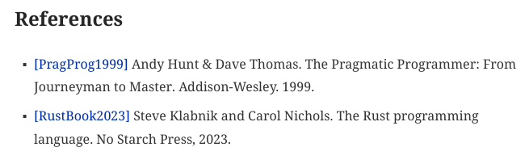

# Book Template - AsciiDoc Version

This book serves as a book template. To create a book, just clone this repo and start writing using [AsciiDoc](https://asciidoc.org/). Do note that this template uses Ruby version - [Asciidoctor](https://asciidoctor.org/). 

## Tools

This template just need Ruby, Asciidoctor, and `asciidoctor-pdf` and some extensions. Do this to install them (you should [install Ruby first](https://www.ruby-lang.org/en/downloads/)):

```
$ gem install --user-install asciidoctor asciidoctor-pdf asciidoctor-bibliography asciidoctor-bibtex asciidoctor-diagram asciidoctor-rouge asciidoctor-epub3
```

Currently, this template uses:

```bash
$ gem list --local | grep asciidoctor
asciidoctor (2.0.23)
asciidoctor-bibliography (0.11.0)
asciidoctor-bibtex (0.9.0)
asciidoctor-diagram (2.3.1)
asciidoctor-diagram-batik (1.17)
asciidoctor-diagram-ditaamini (1.0.3)
asciidoctor-diagram-plantuml (1.2024.8)
asciidoctor-epub3 (2.1.3)
asciidoctor-lists (1.1.2)
asciidoctor-pdf (2.3.19)
asciidoctor-rouge (0.4.0)
$
```

You may as well install other Asciidoctor extensions. Search rubygems for asciidoctor and you may find some extensions below:

```bash
asciidoctor-bilibili (0.0.0)
    哔哩哔哩 (゜-゜)つロ 干杯~
asciidoctor-boost (0.1.7)
    Author: Dave O'Connor
    Asciidoctor macros for Boost documentation
asciidoctor-chart (1.0.0)
    Adds a chart block and block macro to AsciiDoc
asciidoctor-comment-links (0.0.2)
    Turn the link in the comment of the source block into a clickable
    jump link.
asciidoctor-confluence (0.0.2)
    Publishing Asciidoctor content as Confluence page
asciidoctor-confluence-fix (0.0.3)
    This is an implementation of asciidoctor/asciidoctor-confluence
asciidoctor-confluence-sy (0.1.0)
    This is an implementation of asciidoctor/asciidoctor-confluence
asciidoctor-confluence_publisher (0.1.1)
    Parse asciidoc and publish the document to confluence.
asciidoctor-csand (0.3.4)
    asciidoctor-csand lets you write CSA Normal Documents (CSAND) in
    AsciiDoc.
asciidoctor-csd (0.4.6)
    asciidoctor-csd lets you write CSD in AsciiDoc.
asciidoctor-defmastership (1.2.0)
    asciidoctor extension to handle applicable definition references
asciidoctor-diagram-cacoo (0.2.2)
    a ruby gem for asciidoctor-diagram to use Cacoo diagrams
asciidoctor-diagram-eralchemy (0.1.0)
    Asciidoctor ERAlchemy extension
asciidoctor-diagram-jsyntrax (1.38.2)
    JSyntrax JAR files wrapped in a Ruby gem
asciidoctor-diagram-office (0.1.2)
    Asciidoctor diagram extension, with support for Office documents
asciidoctor-diagram-stupid (0.1.0)
    Generate Stupid diagrams with Asciidoctor.
asciidoctor-dita-topic (1.0.9)
    A custom AsciiDoc converter that generates individual DITA topics
asciidoctor-doctest (1.5.2.0)
    Test suite for Asciidoctor backends
asciidoctor-external-callout (1.2.1)
    Asciidoc extension for adding callouts without marking up the source
    listing block.
asciidoctor-fb2 (0.7.0)
    Converts AsciiDoc documents to FB2 e-book formats
asciidoctor-fixxrefs (0.0.1)
    Asciidoctor fix xrefs
asciidoctor-foodogsquared-extensions (1.2.1)
    foo-dogsquared's custom Asciidoctor extensions
asciidoctor-gb (0.3.7)
    asciidoctor-gb lets you write GB standards in AsciiDoc.
asciidoctor-git-include (1.2.0)
    Fetch files from Git repositories while rendering asciidoc files.
asciidoctor-github-include (0.0.2)
    Fetch files from private GitHub repos when you render your asciidoc
    files, using a GitHub private access token.
asciidoctor-godoc (0.1.0)
    An Asciidoctor extension to add a 'godoc' macro.
asciidoctor-html5ruby (0.0.2)
    First release for me.
asciidoctor-html5s (0.5.1)
    Semantic HTML5 backend (converter) for Asciidoctor
asciidoctor-htmlbook (0.0.6)
    Asciidoctor HTMLBook is an Asciidoctor backend for converting
    AsciiDoc documents to HTMLBook documents.
asciidoctor-i18n (0.1.4)

asciidoctor-include-ext (0.4.0)
    Asciidoctor's standard include::[] processor reimplemented as an
    extension
asciidoctor-indir-extension (0.1.5)
    An Asciidoctor extension that adds a variable `indir`, which always
    points to the directory of the currently included asciidoc file
asciidoctor-indir_ext (0.1.4)
    An Asciidoctor extension that adds a variable `indir`, which always
    points to the directory of the currently included asciidoc file
asciidoctor-interdoc-reftext (0.5.3)
    Asciidoctor extension providing implicit (automatic) reference text
    (label) for inter-document cross references
asciidoctor-iso (0.10.4)
    asciidoctor-iso lets you write ISO standards in AsciiDoc.
asciidoctor-jenkins-extensions (0.9.0)
    a collection of Asciidoctor extensions which enable more advanced
    formatting in Jenkins-related content.
asciidoctor-json-value-loader (0.2.1)
    An asciidoctor extention to load specific JSON value.
asciidoctor-katex (0.4.1)
    Asciidoctor extension that converts latexmath to HTML using KaTeX at
    build-time
asciidoctor-katex-2 (0.0.1)
    Asciidoctor extension to render Katex mathematics server side to
    HTML fast with Schmooze
asciidoctor-kindle (0.2.0)
    Asciidoctor extension for converting html to mobi
asciidoctor-kroki (0.10.0)
    Asciidoctor extension to convert diagrams to images using Kroki
asciidoctor-lazy-images (0.0.6)
    Add the loading=lazy attribute to images rendered by the HTML5
    backend!
asciidoctor-legal (0.0.1)
    Extensions and features tailred at writing legal documents like
    patents and contracts.
asciidoctor-m3d (0.3.6)
    asciidoctor-m3d lets you write M3AAWG Documents (M3D) in AsciiDoc.
asciidoctor-mathematical (0.3.5)
    Asciidoctor STEM processor based on Mathematical
asciidoctor-mathjax3 (0.0.1)
    Asciidoctor Plugin that converts latexmath using Mathjax 3
asciidoctor-mathml (0.1.1)
    AsciiDoctor extension to convert STEM to MathML
asciidoctor-mermaid (0.4.1)
    An Asciidoctor extension that transforms Mermaid diagrams in
    markdown codefences to inline svgs.
asciidoctor-metanorma_sample (0.3.3)
    Sample Metanorma Asciidoctor gem.
asciidoctor-multipage (0.0.19)
    Asciidoctor multipage HTML output extension
asciidoctor-nabetani (0.1.4)
    An assortment of things I needed to make a Japanese PDF document
    with asciidoctor.
asciidoctor-p2e (0.3.0)
    An Asciidoctor extension for creating content for the Pathfinder 2E
    roleplaying system.
asciidoctor-pdf-cjk (0.1.3)
    asciidoctor-pdf CJK extension
asciidoctor-pdf-cjk-kai_gen_gothic (0.1.1)

asciidoctor-pdf-cjk-kaigen-gothic-kr (0.1.1)

asciidoctor-pdf-linewrap-ja (0.8.0)
    Asciidoctor PDF extension providing better line wrap for Japanese
    document.
asciidoctor-plantuml (0.1.1)
    Asciidoctor support for PlantUML diagrams.
asciidoctor-question (0.5.2)
    An extension.rb for asciidoctor-question that adds support for
    multiple choice and gap questions
asciidoctor-reducer (1.1.0)
    Reduces an AsciiDoc document containing includes and conditionals to
    a single AsciiDoc document.
asciidoctor-requirements (1.0.0)
    An asciidoctor extension that transforms a yaml block in a formatted
    requirement.
asciidoctor-revealjs (5.2.0)
    A reveal.js converter for Asciidoctor. Write your slides in
    AsciiDoc!
asciidoctor-rfc (0.9.2)
    asciidoctor-rfc lets you write Internet-Drafts and RFCs in AsciiDoc.
asciidoctor-rsd (0.3.6)
    asciidoctor-rsd lets you write RSD in AsciiDoc.
asciidoctor-rubyeval (1.0.0)
    asciidoctor extension to evaluate ruby statements
asciidoctor-sail (0.2)
    An Asciidoctor extension that supports including formatted Sail
    source in ISA manuals
asciidoctor-server (0.4.0)
    Run asciidoctor as a server
asciidoctor-templates-compiler (0.7.0)
    Compile templates-based Asciidoctor converter (backend) into a
    single Ruby file
asciidoctor-tex2svg (0.0.1)
    Asciidoctor STEM processor based on MathJax tex2svg
asciidoctor-texnical (0.0.2)
    Asciidoctor STEM processor shelling out to latex
asciidoctor-xml-ast (0.2.0)
    Converter for Asciidoctor syntax to XML
asciidoctor_cjk_breaks (0.0.2)
    Suppress line breaks between east asian characters
faa-asciidoctor-extension (0.3)
    faa asciidoctor extensions
guard-asciidoctor (0.1.1)
    asciidoctor guard
jekyll_asciidoctor_pdf (0.3.3)
    Rake tasks to convert *.adoc files from Jekyll to PDF using
    asciidoctor-pdf
nanoc-asciidoctor (2.0.2)
    (Obsolete) Asciidoctor filter for Nanoc
asciidoctor-youtube (0.0.0)
    Automatic aspect ratio
faa-asciidoctor-extension (0.3)
    faa asciidoctor extensions
neo4j-asciidoctor-extensions (1.0.2)
    Asciidoctor extensions by Neo4j.
rake_jekyll_asciidoctor_pdf (0.0.13)
    Rake tasks to convert *.adoc files from Jekyll to PDF using
    asciidoctor-pdf
reverse_asciidoctor (0.2.2)
    Convert html code into asciidoctor.
```

Above extensions are not used in this template but feel free to use in your book if you want to.

## Compiling to PDF

Use `Makefile`. The result will be in [build](build/) directory. I also made an example of diagram (as code - using [ditaa](https://github.com/pepijnve/ditaa)) but this is purely optional. Please read [Makefile](Makefile) first. If you don't require diagram you don't need to use `-r asciidoctor-diagram` in the Makefile and bypass the diagram example below.

```bash
$ make
```

## Using This Template

### Contents

All contents are in [contents](contents/). You have to sync all those filenames in that directory with `book-title.adoc`. 

### Images

* All images reside in [images](images/). Of course you are free to arrange how to put the images inside, for example you may use `xx` directory where `xx` is *chapter*. For example, if you have image in chapter 01 - named `myImage.png`, then put `myImage.png` inside `ch01` directory inside `images`.
* In Asciidoc document, use this source code:

```asciidoc
[#img-ch01-01]
.Caption of the Image
[link=https://www.onlywhenyouneedto.org]
image::ch01/myImage.png[]
```

* If you want to make a link - *cross reference* which refers to the image:

```asciidoc
... lorem sum dolor lorem sum dolor lorem sum dolor <<#img-ch01-01>> ...
```

You may also change the top directory name for *images* in `book-title.adoc` description:

```
:imagesdir: images
```

### Source Code

* Put source code inside [src](src/). Also, you may manage whatever you like with how you put your source code (or maybe also depends on programming language that you use. for example in Rust you use `src/main.rs` inside a project, or in Java you use `src/main/java/package/App.java`. It's better if you put chapter number like `ch01` for chapter 01.
* Ruby uses its own gem for syntax highlighting. This template uses **Rouge**, so you have to install it first using: `gem install rouge --user-install`.
* In asciidoc, use this source code (example in Rust - `ferris` is project name inside chapter 01):

```
[source,rust,linenums]
----
include::../{sourcedir}/ch01/ferris/src/main.rs[]
----
<1> Explanation - callout for number 1
<2> Explanation - callout  for number 2
```

Again, you may also change the top directory name for *source code* in `book-title.adoc` description:

```
:sourcedir: src
```

**Note**: remove **linenums** in **[source,rust,linenums]** if you don't want to use line numbering in source code.

### Bibliography

See [example of bibliography file](contents/additional-00-bibliography.adoc):

```asciidoc
== References

* [[[PragProg1999]]] Andy Hunt & Dave Thomas. The Pragmatic Programmer: From Journeyman to Master. Addison-Wesley. 1999.
* [[[RustBook2023]]] Steve Klabnik and Carol Nichols. The Rust programming language. No Starch Press, 2023.
```

Inside `book-title.adoc`, put the filename:

```asciidoc
[bibliography]
include::{includedir}/additional-00-bibliography.adoc[]
```

In document where we want to cite the reference (see the mark on the References above, should be the same with the citation):

```asciidoc
...
... let's pretend that this part is cited from <<PragProg1999>>. ...
...
... Of course, never let the Rust book left behind <<RustBook2023>>....
...
```

Result in document:


Result in **References**:



### Diagram

Asciidoctor has an extension if we want to make a diagram using textual description (so-called *diagram as code*). To use this feature, install asciidoctor-diagram first. Do this if you haven't install it:

```
$ gem install --user-install asciidoctor-diagram
```

Example of source code:

[contents/01-02-title.adoc](contents/01-02-title.adoc)

```bash
=== Rust Compilation Process

The process can be seen at <<#img-ch01-02-compile-process>>.

[#img-ch01-02-compile-process]
.Rust Compilation Process
[ditaa, target="rust-compilation-process"]
----
 +--------+             +---------+   +--------------+   +----------+   +------------+
 |        |             | Lexing  |   |              |   |          |   |            |
 | Source | Invocation  | and     |   | AST lowering |   | MIR      |   | Code       |
 | code   |------------>| parsing |-->| (HIR)        |-->| lowering |-->| generation |
 |        |             |         |   |              |   |          |   |            |
 +---+----+             +---------+   +--------------+   +----------+   +------------+
----
```

The result will be generated on-the-fly (filename will be the same as defined in `target` + .png). The image will be generated and saved at the location which has been defined in `book-title.adoc`. In this case, the location is:

```asciidoc
:imagesoutdir: images/cache
```

The result is:

[images/cache/rust-compilation-process.png](images/cache/rust-compilation-process.png)

```bash
$ ls -la images/cache/
total 20
drwxr-xr-x 2 bpdp bpdp 4096 Jun 16 13:03 ./
drwxr-xr-x 5 bpdp bpdp 4096 Jun 16 12:58 ../
-rw-r--r-- 1 bpdp bpdp 9288 Jun 16 13:03 rust-compilation-process.png
$
```


See also [the manual](https://docs.asciidoctor.org/diagram-extension/latest/)

### Appendix

Put these (I made 2 examples of appendices) at the end of `book-title.adoc`. Put appendix inside the files which has been described at `book-title.adoc`

```asciidoc
[appendix]
include::{includedir}/03-01-appendix.adoc[]

[appendix]
include::{includedir}/03-02-appendix.adoc[]
```

And here's an example of appendix:

```asciidoc
= First Appendix

=== Part 1 of first appendix

This is just an example of first - first appendix.

=== Part 2 of first appendix

And this on is an example of second - first appendix.
```

See also [03-02-appendix.adoc](contents/03-02-appendix.adoc)

### Glossary

Put this at the end of `book-title.adoc`. Put glossary inside the file which has been described at `book-title.adoc`

```asciidoc
[glossary]
= Glossary

[glossary]
include::{includedir}/additional-03-glossary.adoc[]
```

And here's an example of glossary:

```asciidoc
terminology 1:: terminology no 1 is an example of glossary
terminology 2::
  terminology no 2 is an example of glossary
```

### Index

If you want to create index, make sure that your build destination file is PDF (asciidoctor-pdf) since Asciidoctor will not produce index for HTML5 output. Basically, what you will do is:

1.  Define index at any source Asciidoctor document.
2.  Define where Asciidoctor should print the index in your main file.

To define index in any source Asciidoctor document:

[See source file](contents/01-02-title.adoc)

```asciidoc
...
...
...
In this chapter, I will give you an example of how to format source code (((source code, formatting, callout))) using AsciiDoctor.
...
...
...
For any other source which doesn't relate to source code in programming language, use this: (((source code, formatting, shell display)))
...
...
...
((Rust compilation process)) can be seen at <<#img-ch01-02-compile-process>>.
...
...
...
```

To define where Index will be printed, put this inside `book-title.adoc``:

```asciidoc
[index]
== Index
```

The resulting document will be clean (no sign of index) but whenever reader click the page on the index result page, pointer will be directed to that page. The clean document:


The index result page:


## Lists

This template uses [asciidoctor-lists](https://github.com/Alwinator/asciidoctor-lists) for list of figures, tables, and source codes. Snippet from [book-title.adoc](book-title.adoc):

```asciidoc
...
...
:listing-caption: Code

:sectnums!:
== List of figures
list-of::image[]
<<<

== List of tables
list-of::table[]
<<<

== List of code snippets
list-of::listing[]
<<<
:sectnums:
...
...
```

`:sectnums!` is used to turn off section number (since it should not be a part of contents). `<<<` is used for page break. Also see [theme description](resources/themes/zimera-theme.yaml) to understand page numbering between front cover and contents of the book. Take a look at this snippet:

```yaml
...
...
page:
  layout: portrait
  margin: [0.75in, 1in, 0.75in, 1in]
  size: Letter
  numbering:
    start-at: 5
...
...
```

We will use normal numbering, started from page 5 (after table of contents and lists). You may need to adjust this number once you finish compilation process (check the page number which mark the end of front page and adjust accordingly). See [the manual](https://docs.asciidoctor.org/pdf-converter/latest/theme/page-numbers/).

## More

If you want to change the layout (fonts, logo, etc):

1. See `Makefile` for command line / shell command to build pdf file. It uses pdf-theme.
2. The theme resides in `resources/themes/` and uses this filename pattern (see also `Makefile`):

        *pdf-theme-name-at-Makefile*-theme.yml

3. See https://docs.asciidoctor.org/pdf-converter/latest/theme/ for more information on creating your own theme.

## License

This template has [Apache 2.0 License](https://www.apache.org/licenses/LICENSE-2.0), however you are free to choose any license for your book.

